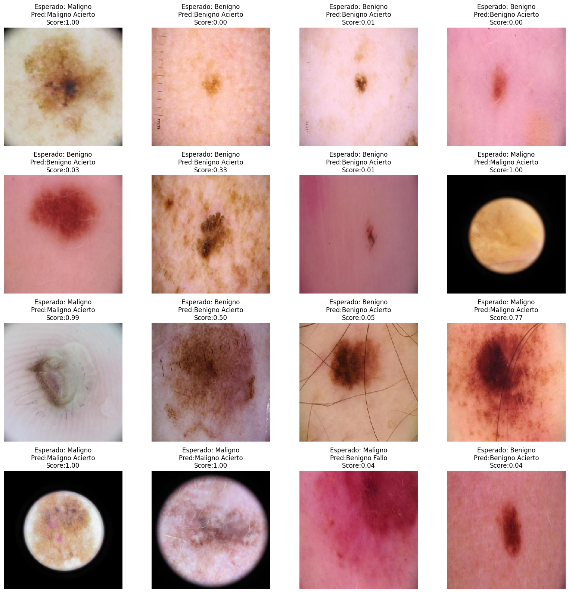
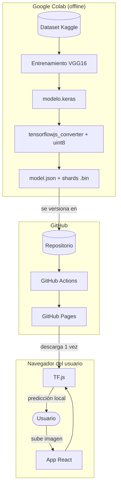
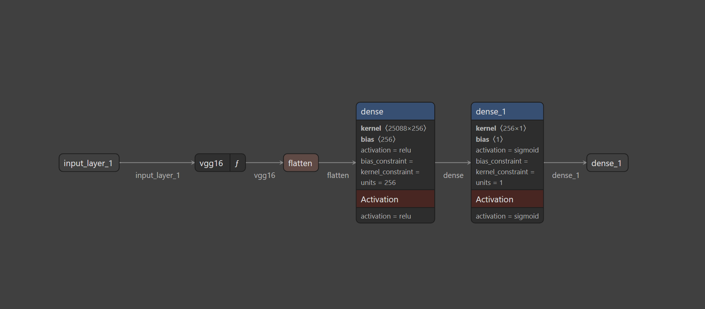
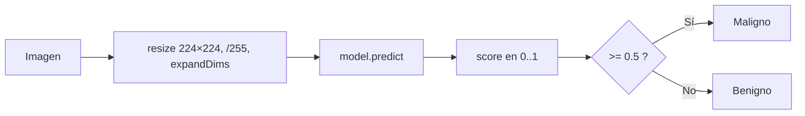
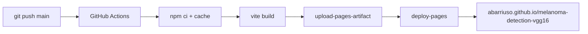

# Melanoma Detection · VGG16 + Fine-tuning

Clasificación binaria de imágenes dermatoscópicas (benigno / maligno) mediante
transfer learning sobre VGG16, con interpretabilidad Grad-CAM y demo web que
ejecuta la inferencia íntegramente en el navegador del usuario.


**Demo en vivo:** https://abarriuso.github.io/melanoma-detection-vgg16/

[](https://pagespeed.web.dev/analysis/https-abarriuso-github-io-melanoma-detection-vgg16/)

Sube una imagen dermatoscópica y obtén la predicción en el propio navegador.
La imagen no se transmite a ningún servidor.

---

## Tabla de contenidos

- [Descripción](#descripción)
- [Resultados](#resultados)
- [Arquitectura](#arquitectura)
- [Metodología de entrenamiento](#metodología-de-entrenamiento)
- [Rigor clínico y robustez](#rigor-clínico-y-robustez)
- [Interpretabilidad](#interpretabilidad-grad-cam-y-grad-cam)
- [Estructura del repositorio](#estructura-del-repositorio)
- [Instalación y uso](#instalación-y-uso)
- [Análisis de seguridad](#análisis-de-seguridad)
- [Consideraciones clínicas](#consideraciones-clínicas)
- [Limitaciones y trabajo futuro](#limitaciones-y-trabajo-futuro)
- [Licencia](#licencia)
- [Autor](#autor)

---

## Descripción

El melanoma es el cáncer de piel más agresivo y su detección temprana es
determinante para la supervivencia. Este proyecto entrena un modelo de deep
learning capaz de distinguir lesiones benignas de malignas a partir de imágenes
dermatoscópicas, como prueba de concepto de un sistema de apoyo al diagnóstico
temprano.

Se parte de VGG16 preentrenado en ImageNet y se aplica una estrategia de
entrenamiento en dos fases (feature extraction + fine-tuning) con `class_weight`
sesgado hacia la sensibilidad, alcanzando un AUC de 0.961 sobre el conjunto
de test.

Además del modelo, el proyecto incluye una demo web que ejecuta la inferencia
íntegramente en el navegador del visitante (vía TensorFlow.js), sin enviar la
imagen a ningún servidor.

| | |
|---|---|
| **Tarea** | Clasificación binaria de imágenes |
| **Modelo base** | VGG16 (ImageNet) |
| **Técnicas** | Transfer learning, fine-tuning, data augmentation, Grad-CAM, calibración, MC Dropout |
| **Dataset** | [Melanoma Skin Cancer Dataset — 10 000 imágenes](https://www.kaggle.com/datasets/hasnainjaved/melanoma-skin-cancer-dataset-of-10000-images) (CC0) |
| **Entorno de entrenamiento** | Google Colab (GPU T4) + Google Drive |
| **Framework ML** | TensorFlow / Keras |
| **Demo web** | React 18 + Vite + TensorFlow.js |
| **Hosting** | GitHub Pages (despliegue automático con Actions) |

---

## Resultados

Resultados medidos sobre el conjunto de test (1 000 imágenes, 500 por clase):

| Métrica | Valor |
|---------|:-----:|
| Accuracy | 88.8 % |
| AUC | **0.961** |
| Average Precision | 0.966 |
| Sensibilidad (recall maligno) | 87.8 % |
| Especificidad | 89.8 % |
| Precision maligno (VPP) | 89.6 % |
| F1-score (macro) | 0.89 |
| Temperatura de calibración (T) | 0.902 |
| ECE (Expected Calibration Error) tras calibrar | 0.025 |

### Matriz de confusión

|  | Pred. Benigno | Pred. Maligno |
|---|:---:|:---:|
| **Real Benigno** | 449 (TN) | 51 (FP) |
| **Real Maligno** | 61 (FN) | 439 (TP) |

Los 61 falsos negativos (malignos clasificados como benignos) son el error
clínicamente más crítico. El uso de `class_weight={0:1, 1:1.3}` durante el
entrenamiento empuja al modelo a priorizar la sensibilidad: detecta más
melanomas a cambio de un mayor número de falsos positivos. Ver
[Consideraciones clínicas](#consideraciones-clínicas).

> **Sesgo del dataset:** el modelo se entrenó con el *Melanoma Skin Cancer
> Dataset* de Kaggle (10 000 imágenes, 50/50 benigno/maligno). La prevalencia
> real de malignos en clínica es ≪ 50 %, y la distribución de tonos de piel,
> equipamiento y condiciones de captura puede no representar poblaciones
> diversas. Los resultados son orientativos y no validados clínicamente.

### Predicciones individuales



Muestra del conjunto de test con clase esperada, predicha y score del modelo.

---

## Arquitectura

### Visión general del sistema

El sistema se compone de tres capas desacopladas:

| Capa | Entorno | Responsabilidad |
|------|---------|-----------------|
| Entrenamiento | Google Colab (GPU) | Entrenar y exportar el modelo |
| Inferencia | Navegador del usuario | Clasificar imágenes con TensorFlow.js |
| Hosting | GitHub Pages + Actions | Servir archivos estáticos y automatizar el deploy |

El principio rector es mover el cómputo al cliente: la inferencia se ejecuta
en el navegador, eliminando el backend y sus costes, latencia y superficie
de ataque asociados. La imagen nunca sale del dispositivo del usuario.



La imagen del usuario nunca abandona el navegador. La única comunicación con
el servidor es la descarga inicial de los archivos estáticos.

### Modelo de deep learning

```
Input (224 × 224 × 3)
   |
   v
VGG16 (pesos ImageNet)
   - Fase 1: completamente congelado
   - Fase 2: bloque 5 descongelado (block5_conv1-3 + pool)
   |
   v
GlobalAveragePooling2D
   v
Dense(256, ReLU)
   v
Dropout(0.5)
   v
Dense(1, Sigmoid)  ->  P(maligno)
```

Diagrama de la arquitectura del modelo, visualizado con [Netron](https://netron.app/):



### Aplicación web (React + TF.js)



- React 18 + Vite, estado local con hooks (sin Redux ni context global).
- Sin backend: toda la lógica vive en el cliente.
- Patrón singleton para cargar el modelo una sola vez; descarga ~15 MB.
- Gestión de memoria con `tf.tidy()` + `try/finally` y `dispose()` para evitar
  fugas de tensores WebGL.
- Token de cancelación: si el usuario lanza un análisis nuevo (o quita la
  imagen) antes de que termine el anterior, el resultado tardío se descarta.
- Calibración del notebook (Temperature Scaling, `T = 0.902`) reproducida en
  el cliente para que la confianza mostrada sea honesta.
- Bundle partido manualmente: `tfjs` en su propio chunk (~250 KB gz, cacheable
  entre releases) y la galería de evaluación cargada con `React.lazy`. El
  chunk de la app baja a ~50 KB gz, así React pinta antes de que TF.js
  termine de descargarse y parsearse.
- Validación del archivo subido: JPEG/PNG/WebP y ≤10 MB, con feedback visible.
- Tipografías (Inter / JetBrains Mono) auto-hostadas vía `@fontsource`. Sin
  conexiones a `fonts.googleapis.com`.

### Despliegue (GitHub Pages + Actions)



Despliegue automático e idempotente. Cada push a main reconstruye y publica.

### Decisiones técnicas

| Decisión | Alternativa descartada | Razón |
|----------|------------------------|-------|
| Inferencia client-side | API REST con backend | Sin coste de servidor, sin latencia de red, la imagen no abandona el dispositivo |
| GitHub Pages | Servidor propio | Cero mantenimiento, HTTPS nativo, mismo origen (sin CORS) |
| TF.js + cuantización uint8 | Modelo float32 (~84 MB) | Carga 4× más rápida |
| React + Vite | HTML/JS vanilla | Mantenibilidad, componentes, valor de portfolio |
| Code-splitting (`tfjs` en su chunk) | Bundle único de ~300 KB gz | UI pinta antes y el chunk se cachea entre releases |
| `@fontsource` auto-hostado | `<link>` a Google Fonts | Sin third-party fetches, sin cookies, mismo origen |
| Transfer learning (VGG16) | Entrenar desde cero | Dataset pequeño (10k); reutilizar features de ImageNet |
| Fine-tuning solo bloque 5 | Descongelar todo | Adaptar features de alto nivel sin destruir las genéricas |
| GlobalAveragePooling | Flatten | Menos parámetros, menos overfitting, modelo más ligero |

---

## Metodología de entrenamiento

### Pipeline de datos

- Carga con `tf.data` (`image_dataset_from_directory`) + `prefetch(AUTOTUNE)`.
- Split: 80 % entrenamiento / 20 % validación + conjunto de test independiente.
- Data augmentation como capas: `RandomFlip`, `RandomRotation`, `RandomZoom`,
  `RandomTranslation`, `RandomBrightness`, `RandomContrast`. Solo se aplican en
  entrenamiento.

### Entrenamiento en dos fases

| | Fase 1 — Feature Extraction | Fase 2 — Fine-tuning |
|---|---|---|
| VGG16 | Congelado | Bloque 5 descongelado |
| Optimizer | RMSprop | Adam |
| Learning rate | 1e-4 | 1e-5 |
| Épocas (máx.) | 20 | 30 |

Callbacks: `ModelCheckpoint` (mejor `val_loss`), `EarlyStopping`
(paciencia 7-10), `ReduceLROnPlateau` (×0.5 al estancarse).

---

## Rigor clínico y robustez

La accuracy por sí sola no valida un modelo médico. El notebook incluye una
sección dedicada a evaluar el modelo como lo haría un sistema clínico:

| Análisis | Qué aporta |
|----------|------------|
| Sensibilidad y especificidad | Métricas médicas estándar. Se prioriza la sensibilidad (no perder melanomas) sobre la accuracy global. |
| Análisis del umbral | Curva sensibilidad/especificidad frente al umbral de decisión. Muestra cómo bajar de 0.5 a 0.3 reduce los melanomas no detectados. |
| Curva Precision-Recall | El test está balanceado 50/50, pero la prevalencia clínica real de malignos es ≪50 %. PR refleja mejor que ROC el comportamiento esperado en ese régimen desbalanceado. |
| Calibración (Temperature Scaling) | Corrige la sobreconfianza del modelo midiendo el ECE (Expected Calibration Error) y un diagrama de fiabilidad. Una probabilidad del 80% pasa a significar realmente un 80% de acierto. |
| Test-Time Augmentation (TTA) | Promedia predicciones de N augmentaciones de la misma imagen. Reduce la varianza de la predicción sin reentrenar. |
| Incertidumbre (MC Dropout) | 30 inferencias con dropout activo estiman cuánto duda el modelo. En un sistema clínico real, las predicciones de alta incertidumbre serían las candidatas a derivar a un especialista (la demo no expone aún esta señal). |
| Análisis cualitativo de errores | Grad-CAM sobre los falsos negativos para identificar qué características engañan al modelo. |

La calibración del notebook se conecta con la demo web: el valor de temperatura
`T` se traslada a [`demo/src/lib/model.js`](demo/src/lib/model.js) para que la
confianza mostrada al usuario sea honesta.

## Interpretabilidad: Grad-CAM y Grad-CAM++

Para verificar que el modelo mira la lesión y no artefactos del fondo (pelo,
reglas dermatoscópicas, reflejos), se incluyen Grad-CAM y su versión mejorada
Grad-CAM++, que generan mapas de calor con las regiones más influyentes en
cada predicción. Grad-CAM++ pondera los gradientes positivos píxel a píxel, lo
que mejora la localización cuando hay varias zonas relevantes.

```
Imagen original  ->  Activaciones block5_conv3  ->  Gradientes  ->  Heatmap superpuesto
```

---

## Estructura del repositorio

```
.
├── melanoma_detection_v2.ipynb     Notebook principal
├── demo/                           Demo web (React + TensorFlow.js)
│   ├── src/
│   │   ├── main.jsx                Punto de entrada de React
│   │   ├── App.jsx                 Panel de análisis individual
│   │   ├── App.css
│   │   ├── ResultsGallery.jsx      Clasificación en lote sobre test
│   │   ├── ResultsGallery.css
│   │   ├── index.css               Tokens de diseño y reset
│   │   ├── ErrorBoundary.jsx       Error boundary de React
│   │   └── lib/
│   │       ├── model.js            Carga del modelo + inferencia + calibración
│   │       ├── gradcam.js          Cálculo y pintado de Grad-CAM
│   │       └── constants.js
│   ├── public/
│   │   ├── model/                  Modelo TF.js (model.json + shards .bin)
│   │   ├── samples/                Imágenes del dataset para la demo
│   │   ├── favicon.svg
│   │   └── og.png                  Open Graph 1200×630 (compartir en redes)
│   ├── index.html
│   ├── vite.config.js
│   ├── eslint.config.js
│   └── package.json
├── scripts/
│   ├── download_dataset.ps1        Descarga del dataset de Kaggle
│   ├── convert-to-tfjs.mjs         Conversión Keras → TF.js (con temperature)
│   └── gen-og.mjs                  Regenera demo/public/og.png
├── .github/workflows/
│   └── deploy.yml                  Despliegue automático a GitHub Pages
├── assets/                         Imágenes para el README
├── README.md
├── requirements.txt
├── LICENSE
└── .gitignore
```

Archivos excluidos del repositorio (`.gitignore`):

- `*.keras` (modelos entrenados, ~184 MB).
- `archive/` y `dataset/` (dataset, ~103 MB).
- `node_modules/`, `dist/`, `*.exe`, `*.pem`, `.env`.

---

## Instalación y uso

### A. Entrenar el modelo

**Opción 1 — Google Colab (recomendada)**

1. Sube el dataset `melanoma_cancer_dataset/` a la raíz de tu Google Drive.
   Estructura: `MyDrive/melanoma_cancer_dataset/{train,test}/{benign,malignant}/*.jpg`.
2. Abre `melanoma_detection_v2.ipynb` en [Google Colab](https://colab.research.google.com/).
3. Activa la GPU: Entorno de ejecución > Cambiar tipo de entorno > T4 GPU.
4. Ejecuta todas las celdas.

**Opción 2 — Local**

```bash
git clone https://github.com/abarriuso/melanoma-detection-vgg16.git
cd melanoma-detection-vgg16
pip install -r requirements.txt
pwsh ./scripts/download_dataset.ps1
jupyter notebook melanoma_detection_v2.ipynb
```

Tamaños orientativos del modelo:
184 MB (con optimizador) → ~84 MB (solo inferencia) → ~15 MB (TF.js + uint8).

### B. Convertir Keras a TF.js

Necesario para que la demo web funcione. Ejecutar en Google Colab tras entrenar:

```python
import tensorflowjs as tfjs
from tensorflow.keras.models import load_model

modelo = load_model('/content/drive/MyDrive/melanoma_model/melanoma_v2_final.keras')
tfjs.converters.save_keras_model(
    modelo, '/content/tfjs_model',
    quantization_dtype_map={'uint8': '*'}
)
```

Después: descargar `tfjs_model/` y copiar su contenido (`model.json` + `*.bin`)
a `demo/public/model/`.

### C. Demo web en local

```bash
cd demo
npm install
npm run dev         # http://localhost:5173
npm run build       # producción
npm run lint        # ESLint
```

Requiere el modelo convertido en `demo/public/model/`.

### D. Desplegar en GitHub Pages

El despliegue es automático vía GitHub Actions. Cada push a main reconstruye
y publica.

Configuración inicial (una sola vez):

1. Settings > Pages > Build and deployment > Source > GitHub Actions.
2. Verificar que `base` en `demo/vite.config.js` coincide con el nombre del repo.
3. Push a main.

---

## Análisis de seguridad

**Nivel de riesgo global: bajo.** La arquitectura client-side + hosting estático
elimina las categorías de ataque más comunes (inyección SQL, SSRF, fugas del
servidor).

### Privacidad por diseño

| Control | Estado |
|---------|--------|
| Imagen procesada en el navegador | Sí |
| Imagen enviada a servidor | No |
| Cookies / tracking / analytics | Ninguno |
| Conexiones third-party (fuentes, CDN, métricas) | Ninguna |
| Almacenamiento persistente | Ninguno |
| Datos personales procesados en servidor | Ninguno |

### Modelo de amenazas

| # | Riesgo | Probabilidad | Impacto | Nivel | Mitigación |
|---|--------|:---:|:---:|:---:|------------|
| 1 | Compromiso de dependencia npm | Baja | Medio | Medio | Lockfile, Dependabot, npm audit |
| 2 | Commit accidental de secreto | Media | Alto | Medio | .gitignore, gitleaks |
| 3 | Ejemplo adversarial | Media | Bajo | Bajo | Disclaimer clínico |
| 4 | MITM | Muy baja | Medio | Bajo | HTTPS + HSTS |
| 5 | Fuga de imagen del usuario | Muy baja | Alto | Bajo | Inferencia local |
| 6 | Mal uso clínico | Media | Alto | Medio | Disclaimer visible |

### Hardening aplicado

- Validación de la subida: MIME-type (JPEG/PNG/WebP) y límite de 10 MB.
- `permissions` mínimos en el workflow (`contents:read`, `pages:write`,
  `id-token:write`) y `concurrency.cancel-in-progress`.
- Sin third-party fetches (fuentes auto-hostadas).

### Hardening pendiente

- Dependabot + `npm audit` continuos.
- Escaneo de secretos (gitleaks como pre-commit hook).

---

## Consideraciones clínicas

En detección de cáncer, los dos tipos de error no son equivalentes:

| Error | Significado | Consecuencia |
|-------|-------------|--------------|
| Falso Negativo | Maligno clasificado como benigno | Cáncer no detectado — riesgo vital |
| Falso Positivo | Benigno clasificado como maligno | Biopsia innecesaria — menor gravedad |

Por ello se prioriza el recall de la clase maligna. En un escenario real, el
umbral de decisión debería bajarse de 0.5 a ~0.3 para minimizar falsos negativos.

**Aviso legal:** este proyecto es académico. No es un dispositivo médico ni
debe usarse para diagnóstico real. Cualquier sospecha clínica requiere
valoración por un dermatólogo certificado.

---

## Limitaciones y trabajo futuro

- Dataset balanceado artificialmente (50/50). En clínica real los malignos son
  ~20 %. El entrenamiento ya compensa con `class_weight={0:1, 1:1.3}`; pendiente
  recalibrar el umbral de decisión a la prevalencia real (prevalence-aware
  thresholding) en lugar de fijarlo en 0.5.
- Backbones más eficientes que VGG16: EfficientNetV2 o MobileNetV3 deberían
  igualar o mejorar el AUC con una fracción de los parámetros (el notebook ya
  incluye una comparativa con ResNet50V2).
- Exponer en la demo la señal de incertidumbre (MC Dropout) y un canal de
  derivación visual para las predicciones de baja confianza.
- Validación externa con datasets más diversos y multicéntricos (ISIC,
  HAM10000) para medir generalización fuera del dominio del dataset de Kaggle.

---

## Licencia

Distribuido bajo licencia MIT. Ver [`LICENSE`](LICENSE), que incluye un
disclaimer clínico y legal sobre las limitaciones del software.

El dataset es de dominio público (CC0), cortesía de
[Hasnain Javed en Kaggle](https://www.kaggle.com/datasets/hasnainjaved/melanoma-skin-cancer-dataset-of-10000-images).

---

## Autor

**Adrián Barriuso Pizarro**

Proyecto académico desarrollado en el Curso de Especialización en IA y Big Data
(IES Ágora, 2024-2025) y refactorizado en 2026 para portfolio.

[LinkedIn](https://www.linkedin.com/in/adrián-barriuso) · [GitHub](https://github.com/abarriuso)
