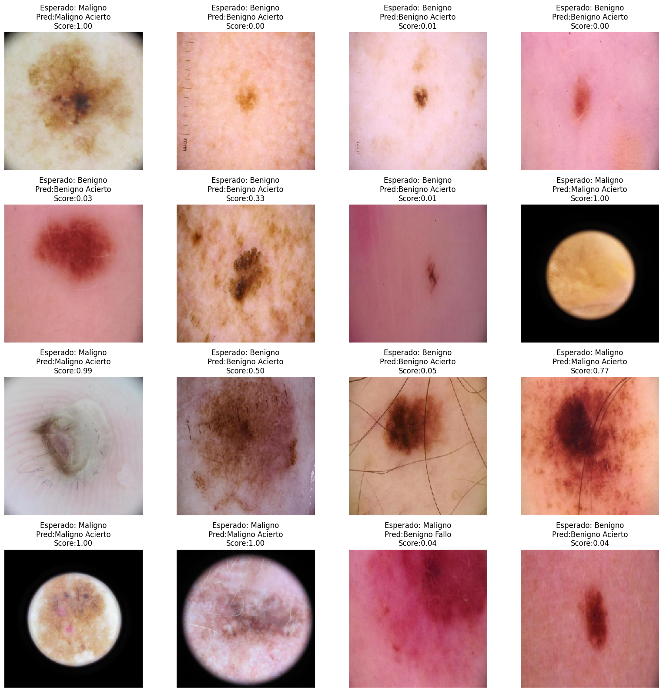

# Detección de melanoma con VGG16

[](https://github.com/abarriuso/melanoma-detection-vgg16/actions/workflows/ci.yml)


Clasificación binaria de imágenes dermatoscópicas (benigno / maligno) mediante
transfer learning sobre VGG16, con una demo web que ejecuta el modelo
íntegramente en el navegador.

**Demo:** https://abarriuso.github.io/melanoma-detection-vgg16/

> Proyecto académico. No es un dispositivo médico: el modelo falla, y falla
> además en el peor sentido posible (~12 % de melanomas clasificados como
> benignos). Aviso completo en [DISCLAIMER.md](DISCLAIMER.md).

## Qué hay en el repo

```
notebooks/            Entrenamiento, uno por backbone (listos para Colab con GPU)
demo/                 Aplicación web (React + TensorFlow.js)
scripts/              Descarga del dataset, conversión a TF.js, utilidades
melanoma_detection_v2.ipynb   Notebook original combinado (referencia histórica)
```

Hay notebooks para tres backbones (VGG16, ResNet50V2 y EfficientNetV2S), pero
**solo VGG16 está entrenado y publicado**. Los otros dos aparecen deshabilitados
en el selector de la demo hasta que entrene y suba sus pesos.

## Resultados

Sobre el conjunto de test (1 000 imágenes, 500 por clase):

| Métrica | Valor |
|---------|:-----:|
| AUC | 0.961 |
| Accuracy | 88.8 % |
| Sensibilidad (recall maligno) | 87.8 % |
| Especificidad | 89.8 % |
| Average Precision | 0.966 |
| ECE tras calibrar (T = 0.902) | 0.025 |

|  | Pred. benigno | Pred. maligno |
|---|:---:|:---:|
| **Real benigno** | 449 | 51 |
| **Real maligno** | 61 | 439 |

Los 61 falsos negativos son el error que importa: un melanoma etiquetado como
benigno. El entrenamiento usa `class_weight={0:1, 1:1.3}` para empujar al
modelo hacia la sensibilidad, a costa de más falsos positivos.

Dos cosas que conviene no perder de vista al leer la tabla: el dataset está
balanceado artificialmente al 50/50 (la prevalencia clínica real es mucho
menor, así que el valor predictivo en la práctica sería otro), y no hay
validación externa — todo sale del mismo dataset de Kaggle, con los sesgos de
captura y de población que eso arrastra.



## Qué se le hace al modelo

Se parte de VGG16 con pesos de ImageNet y sin su cabeza original. Encima va
una cabeza nueva: `GlobalAveragePooling2D → Dense(256, ReLU) → Dropout(0.5) →
Dense(1, sigmoide)`, que produce P(maligno).

El entrenamiento tiene dos fases:

1. **Extracción de características** — el backbone entero congelado; solo
   aprende la cabeza (RMSprop, lr 1e-4, hasta 20 épocas).
2. **Fine-tuning** — se descongela parte del backbone y se reentrena con
   learning rate bajo para adaptar las features de alto nivel sin destruir
   las genéricas.

Los tres notebooks (uno por backbone, en [`notebooks/`](notebooks/)) siguen
exactamente el mismo guion de principio a fin — mismos datos, misma cabeza,
las mismas 11 secciones (arquitectura, las dos fases, métricas clínicas,
Grad-CAM, curva PR, TTA, revisión de falsos negativos, conversión a TF.js) —
y solo cambia lo que cada red necesita para funcionar bien:

| Backbone | Entrada al backbone | Fine-tuning (fase 2) | LR fase 2 | Capa de Grad-CAM |
|---|---|---|---|---|
| VGG16 | `[0, 1]` directo | Últimas 4 capas (bloque 5) | 1e-5 | `block5_conv3` |
| ResNet50V2 | `Rescaling(2, offset=-1)` → `[-1, 1]` | ~80 capas no-BN (BatchNorm congelado) | 1e-6 | `post_relu` |
| EfficientNetV2S | `Rescaling(255)` + preprocesado interno de Keras | ~50 % de las capas (BatchNorm congelado) | 1e-5 | `top_conv` |

En ResNet50V2 y EfficientNetV2S se congela BatchNorm durante el fine-tuning:
sus estadísticas de `moving_mean`/`moving_variance` se corrompen con facilidad
si se reentrenan con los batches pequeños que usa este dataset. VGG16 no tiene
ese problema (no usa BatchNorm), así que ahí sí se descongela todo el bloque.

La augmentation va como capas del grafo (flips, rotación, zoom, traslación,
brillo, contraste) y solo actúa durante el entrenamiento. Con callbacks de lo
habitual: checkpoint por `val_loss`, early stopping y reducción de learning
rate al estancarse.

Un detalle de diseño que simplifica todo lo demás: el modelo recibe la imagen
en `[0, 1]` y **el preprocesado específico del backbone va horneado dentro del
grafo**. El fichero exportado es autocontenido, y el cliente web no necesita
saber qué red tiene delante: siempre hace `pixel / 255` y ya.

Después del entrenamiento se calibra la salida con temperature scaling: una
única constante T = 0.902 que reescala el logit para que la confianza mostrada
se parezca a la frecuencia real de acierto (ECE 0.025). Esa misma T está en
[`demo/src/lib/constants.js`](demo/src/lib/constants.js) y se aplica en el
navegador.

El notebook incluye además el análisis que me pareció mínimo para un problema
médico: sensibilidad/especificidad frente al umbral, curva precision-recall
(más informativa que ROC cuando la prevalencia real es baja), incertidumbre
por MC Dropout y revisión cualitativa de los falsos negativos con Grad-CAM.

## Cómo se sirve

1. El `.keras` de inferencia (~84 MB) se convierte con `tensorflowjs_converter`
   a un `model.json` + 4 shards `.bin` **cuantizados a uint8**: ~15 MB en
   total. La conversión la hace el propio notebook al terminar (también está
   [`scripts/convert-to-tfjs.mjs`](scripts/convert-to-tfjs.mjs) para hacerla
   en local).
2. Esos ficheros se versionan en `demo/public/model/` y GitHub Pages los sirve
   como estáticos. No hay backend: la imagen del usuario no sale del
   navegador.
3. La demo carga el modelo con TF.js sobre WebGL (con caída automática a CPU
   si WebGL no está disponible) y hace un **warmup** nada más cargar: la
   primera inferencia compila los shaders de la GPU, que es lento, y es mejor
   pagarlo durante la barra de carga que en el primer clic del usuario.
4. El score crudo se calibra con la T del entrenamiento y se decide con
   umbral 0.5.
5. Grad-CAM es opcional y se carga con un import dinámico solo si se pide:
   superpone sobre la imagen las regiones que más pesaron en la decisión.
6. Un service worker deja app y modelo en caché (~16 MB) para revisitas y
   uso sin conexión.

**Requisitos del navegador:** hace falta aceleración gráfica por hardware
activada (en Chrome/Edge: Configuración → Sistema → «Usar aceleración por
hardware cuando esté disponible»). Sin ella, WebGL cae a un renderizador
software y cada análisis pasa de décimas de segundo a minutos; la demo lo
detecta y lo avisa en pantalla.

## Ejecutarlo

### Entrenar (Google Colab)

1. Sube el dataset a tu Drive: `MyDrive/melanoma_cancer_dataset/{train,test}/{benign,malignant}/`.
2. Abre el notebook del backbone que quieras desde [`notebooks/`](notebooks/)
   y activa la GPU (Entorno de ejecución → T4).
3. Ejecuta todas las celdas. El notebook entrena, evalúa y exporta el modelo
   ya convertido a TF.js en `MyDrive/melanoma_model/<id>/tfjs/`.

Los notebooks se generan con `node scripts/gen-notebooks.mjs`; no conviene
editar los `.ipynb` a mano.

Para entrenar en local: `pip install -r requirements.txt`, descarga el dataset
con `pwsh ./scripts/download_dataset.ps1` y abre el notebook con Jupyter.

### Meter los pesos en la demo

```bash
cp -r <descarga>/vgg16/tfjs/* demo/public/model/vgg16/
```

Y actualiza `temperature` y las métricas del modelo en
`demo/src/lib/constants.js` (los imprime la celda de calibración).

### Demo en local

```bash
cd demo
pnpm install
pnpm dev         # http://localhost:5173
pnpm test        # Vitest
pnpm lint
pnpm build
```

### Tests y CI

La demo tiene 75 tests unitarios (Vitest + Testing Library): calibración,
selección de modelo y de backend, Grad-CAM, validación de archivos subidos,
el cache de scores y el error boundary. En cada push o PR a `main`,
[`ci.yml`](.github/workflows/ci.yml) corre lint + tests + build;
[`deploy.yml`](.github/workflows/deploy.yml) publica en GitHub Pages tras
cada push a `main`.

## Seguridad y privacidad

- La imagen se procesa en local. No hay analytics, cookies ni peticiones a
  terceros (las fuentes van auto-hosteadas).
- Lo único que persiste en el dispositivo: la preferencia de modelo y los
  scores del test set (localStorage), y app + modelo en Cache Storage para
  el modo offline. Ninguna imagen del usuario ni ningún resultado se guarda.
- CSP sin `unsafe-eval` en producción, inyectada al inicio del `<head>`;
  protección contra iframes en [`frame-guard.js`](demo/public/frame-guard.js)
  (GitHub Pages no permite cabeceras propias).
- CI con permisos por job: el job que instala dependencias solo puede leer;
  publicar solo puede el job de deploy, que no ejecuta nada.
- Dependencias: lockfile congelado en CI, Dependabot (npm y actions),
  overrides para transitivas vulnerables y un cooldown de 24 h antes de
  aceptar versiones recién publicadas.
- Pendiente: escaneo de secretos como pre-commit y pinneo de actions por SHA.

## Consideraciones clínicas

Un falso negativo (melanoma etiquetado benigno) puede costar una vida; un
falso positivo cuesta una biopsia innecesaria. No son errores comparables, y
por eso el entrenamiento prioriza la sensibilidad. En un despliegue real el
umbral debería bajarse de 0.5 (a costa de más biopsias) y recalibrarse a la
prevalencia local — nada de eso está hecho aquí, y es parte de por qué esto
es un ejercicio y no una herramienta.

## Limitaciones

- Un solo dataset, balanceado 50/50 y sin validación externa (ISIC, HAM10000).
- Sin intervalos de confianza ni repeticiones con semillas distintas: los
  números de la tabla son de un único entrenamiento.
- ResNet50V2 y EfficientNetV2S: notebooks listos, pesos sin entrenar.
- La señal de incertidumbre (MC Dropout) se calcula en el notebook pero la
  demo no la expone.
- Solo válido para imágenes dermatoscópicas; con fotos de móvil el modelo
  opera fuera del dominio en que fue entrenado.

## Licencia y datos

Código bajo [MIT](LICENSE). El dataset es el
[Melanoma Skin Cancer Dataset](https://www.kaggle.com/datasets/hasnainjaved/melanoma-skin-cancer-dataset-of-10000-images)
de Kaggle (dominio público, CC0).

## Autor

**Adrián Barriuso Pizarro** — proyecto del Curso de Especialización en IA y
Big Data (IES Ágora, 2024-2025), retomado en 2026.

[GitHub](https://github.com/abarriuso) ·
[LinkedIn](https://www.linkedin.com/in/adrián-barriuso)
